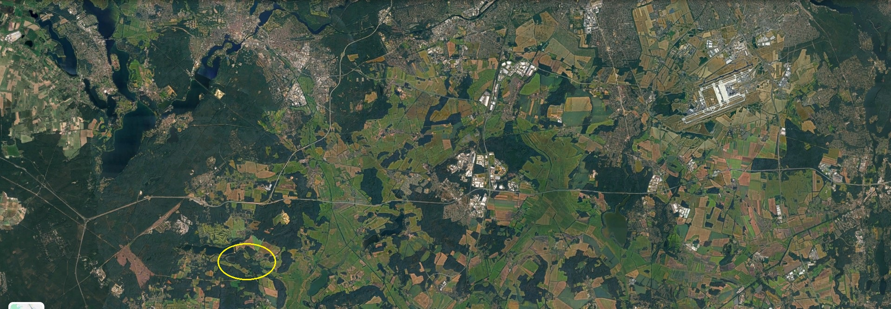
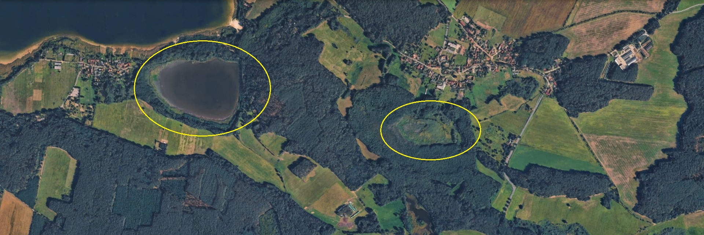
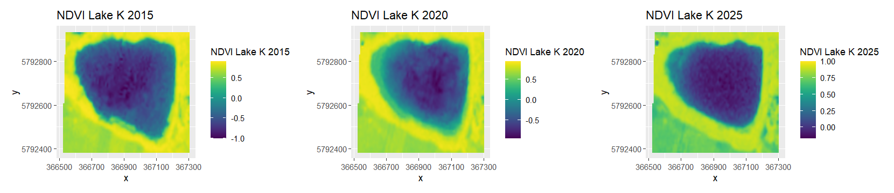
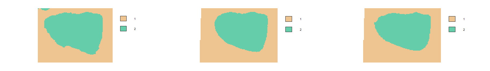
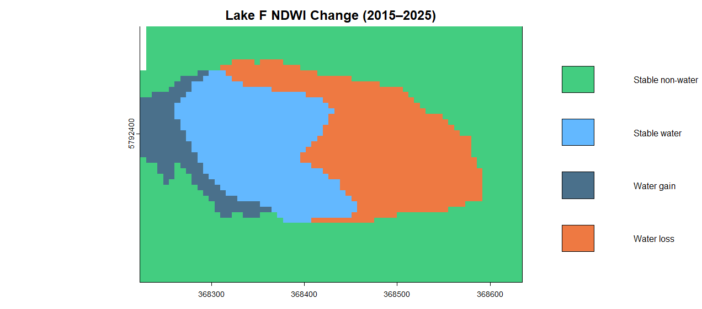
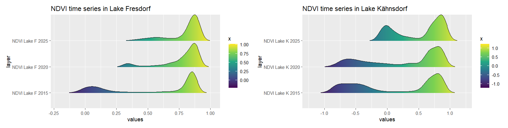

#### Name: Friederike Ulandowski

# Spatial Ecology in R exam

## 1. Introduction
### Research topic:
**Comparison of lake water content in two inland lakes over a time period of 10 years**
<p>
<br>
</p>

### Study area:
Southern Brandenburg, Germany, ca. 30 km south of Berlin
- Lake Fresdorf: ca. 7 ha
- Lake Kähnsdorf ca. 20 ha
<p>
<br>
</p>

**Aerial view:** 



<p>
<br>
</p>


### Research background: </p>
<p> 
The shallow Lake Fresdorf, 30 km south of Berlin, has dried out and been taken over by vegetation in the last 10 years, now resembling peatland more than the lake it once was. The process has been rapid, vanishing the lake within a decade, and was accelerated by the extremely dry summers of 2018, 2019 and 2020 (rbb24.de). As the lake was part of a larger chain of lakes in the region, this exam project investigates whether similarly threatening trends can be observed in the nearby Lake Kähnsdorf, only 1.5 km westwards, or if the two lakes follow different hydrological regimes. 
</p>

<p>
<br>
</p>

## 2. Methodological overview </p>

#### Data sources:
- Aerial screenshots of the study area from Google Earth
- Single raster bands (Red, Green, Blue, NIR) from Copernicus Sentinel-2 L2A for summer 2015, 2020, 2025

#### Methodological overview:
1. Download data files from https://browser.dataspace.copernicus.eu/
2. Load data into R and combine single bands to raster files
3. Compute environmental indices NDWI (water) and NDVI (vegetation)
4. Classify NDWI rasters into 2 categories (water/non-water)
5. Compute a time-series of water content [%] and water area [ha]
6. Plot water content change maps and change tables
7. Create NDWI ridgeline plots

<p>
<br>
</p>

## R code step-by-step

### 1. Downloading satellite bands from Copernicus:
- tiff-format
- high resolution
- bands 02(red), 03(green), 04(blue) and 08(NIR)
- UTM zone 33N
<p>
<br>
</p>


<p>
<br>
</p>

### 2. Preparing the workspace
```{r}
dev.off()
getwd()

library(terra)  
library(imageRy)  
library(viridis)
library(dplyr)
library(ggridges)
library(ggplot2)  
library(patchwork)
```

### 3. Loading data into R
Lake Fresdorf = "F":
```
F2015_b2 <- rast("data/LakeF_2015_B02.tiff")  
F2015_b3 <- rast("data/LakeF_2015_B03.tiff")
F2015_b4 <- rast("data/LakeF_2015_B04.tiff")
F2015_b8 <- rast("data/LakeF_2015_B08.tiff")

F2020_b2 <- rast("data/LakeF_2020_B02.tiff")  
F2020_b3 <- rast("data/LakeF_2020_B03.tiff")
F2020_b4 <- rast("data/LakeF_2020_B04.tiff")
F2020_b8 <- rast("data/LakeF_2020_B08.tiff")

F2025_b2 <- rast("data/LakeF_2025_B02.tiff")  
F2025_b3 <- rast("data/LakeF_2025_B03.tiff")
F2025_b4 <- rast("data/LakeF_2025_B04.tiff")
F2025_b8 <- rast("data/LakeF_2025_B08.tiff"){r}
```

Lake Kähnsdorf = "K":

```{r}
K2015_b2 <- rast("data/LakeK_2015_B02.tiff")  
K2015_b3 <- rast("data/LakeK_2015_B03.tiff")
K2015_b4 <- rast("data/LakeK_2015_B04.tiff")
K2015_b8 <- rast("data/LakeK_2015_B08.tiff")

K2020_b2 <- rast("data/LakeK_2020_B02.tiff")  
K2020_b3 <- rast("data/LakeK_2020_B03.tiff")
K2020_b4 <- rast("data/LakeK_2020_B04.tiff")
K2020_b8 <- rast("data/LakeK_2020_B08.tiff")

K2025_b2 <- rast("data/LakeK_2025_B02.tiff")  
K2025_b3 <- rast("data/LakeK_2025_B03.tiff")
K2025_b4 <- rast("data/LakeK_2025_B04.tiff")
K2025_b8 <- rast("data/LakeK_2025_B08.tiff")
```

Stacking the single bands into multi-layer rasters:


```{r}
F2015 <- c(F2015_b2, F2015_b3, F2015_b4, F2015_b8)
F2020 <- c(F2020_b2, F2020_b3, F2020_b4, F2020_b8)
F2025 <- c(F2025_b2, F2025_b3, F2025_b4, F2025_b8)

K2015 <- c(K2015_b2, K2015_b3, K2015_b4, K2015_b8)
K2020 <- c(K2020_b2, K2020_b3, K2020_b4, K2020_b8)
K2025 <- c(K2025_b2, K2025_b3, K2025_b4, K2025_b8)
```
<p>
<br>
</p>

### 4. Computing the NDWI - Normalized Difference Water Index 
*"The Normalized Difference Water Index (NDWI) is used to highlight open water features in a satellite image, allowing a water body to “stand out” against the soil and vegetation. [...]  Its primary use today is to detect and monitor slight changes in water content of the water bodies."* (EOS data analytics)
<p>
<br>
</p>

For lake F:
```{r}
ndwi_F_2015 <- (F2015_b3 - F2015_b8) / (F2015_b3 + F2015_b8)            # manual NDWI calculation
names(ndwi_F_2015) <- c("NDWI Lake F 2015")                             # rename layer
p1F <- im.ggplot(ndwi_F_2015) + ggtitle("NDWI Lake F 2015")             # create ggplot object

ndwi_F_2020 <- (F2020_b3 - F2020_b8) / (F2020_b3 + F2020_b8)
names(ndwi_F_2020) <- c("NDWI Lake F 2020")
p2F <- im.ggplot(ndwi_F_2020) + ggtitle("NDWI Lake F 2020")

ndwi_F_2025 <- (F2025_b3 - F2025_b8) / (F2025_b3 + F2025_b8)
names(ndwi_F_2025) <- c("NDWI Lake F 2025")
p3F <- im.ggplot(ndwi_F_2025) + ggtitle("NDWI Lake F 2025")

p1F+ p2F + p3F                                                         # multiframe NDWI plot
```
<p>
<br>
</p>


<p>
<br>
</p>

For lake K:
```{r}
ndwi_K_2015 <- (K2015_b3 - K2015_b8) / (K2015_b3 + K2015_b8)     
names(ndwi_K_2015) <- c("NDWI Lake K 2015")
p1K <- im.ggplot(ndwi_K_2015) + ggtitle("NDWI Lake K 2015")

ndwi_K_2020 <- (K2020_b3 - K2020_b8) / (K2020_b3 + K2020_b8)
names(ndwi_K_2020) <- c("NDWI Lake K 2020")
p2K <- im.ggplot(ndwi_K_2020) + ggtitle("NDWI Lake K 2020")

ndwi_K_2025 <- (K2025_b3 - K2025_b8) / (K2025_b3 + K2025_b8)
names(ndwi_K_2025) <- c("NDWI Lake K 2025")
p3K <- im.ggplot(ndwi_K_2025) + ggtitle("NDWI Lake K 2025")

p1K+ p2K + p3K
```
<p>
<br>
</p>


<p>
<br>
</p>

### 5. Computing the NDVI - Normalized Difference Vegetation Index 

*The well known and widely used NDVI is a simple, but effective index for quantifying green vegetation. It normalizes green leaf scattering in Near Infra-red wavelengths with chlorophyll absorption in red wavelengths. The value range of the NDVI is -1 to 1. Negative values of NDVI (values approaching -1) correspond to water.* (Sentinel Hub)
<p>
<br>
</p>

For lake F:
```{r}
ndvi_F_2015 <- im.ndvi(F2015,nir=4, red=1)                          # NDVI calculation with im.ndvi() from imageRy
names(ndvi_F_2015) <- c("NDVI Lake F 2015)                          # rename layer
v1F <- im.ggplot(ndvi_F_2015) + ggtitle("NDVI Lake F 2015")

ndvi_F_2020 <- im.ndvi(F2020,nir=4, red=1)
names(ndvi_F_2020) <- c("NDVI Lake F 2020")
v2F <- im.ggplot(ndvi_F_2020) + ggtitle("NDVI Lake F 2020")

ndvi_F_2025 <- im.ndvi(F2025,nir=4, red=1)
names(ndvi_F_2025) <- c("NDVI Lake F 2025")
v3F <- im.ggplot(ndvi_F_2025) + ggtitle("NDVI Lake F 2025")

v1F + v2F + v3F                                                     # multiframe NDWI plot
```
<p>
<br>
</p>


<p>
<br>
</p>

For lake K:
```{r}
ndvi_K_2015 <- im.ndvi(K2015,nir=4, red=1)
names(ndvi_K_2015) <- c("NDVI Lake K 2015")
v1K <- im.ggplot(ndvi_K_2015) + ggtitle("NDVI Lake K 2015")

ndvi_K_2020 <- im.ndvi(K2020,nir=4, red=1)
names(ndvi_K_2020) <- c("NDVI Lake K 2020")
v2K <- im.ggplot(ndvi_K_2020) + ggtitle("NDVI Lake K 2020")

ndvi_K_2025 <- im.ndvi(K2025,nir=4, red=1)
names(ndvi_K_2025) <- c("NDVI Lake K 2025")
v3K <- im.ggplot(ndvi_K_2025) + ggtitle("NDVI Lake K 2025")

v1K + v2K + v3K
```
<p>
<br>
</p>



*Note how the colour scale is consistent between the NDWI and NDVI graphics but the images seems "flipped" in colours, underlining the spectral differences between water and vegetated surfaces.*

<p>
<br>
</p>

### 6. Classifying the NDWI rasters into 2 categories (water/non-water)


```{r}
colours2 <- c("burlywood2", "aquamarine3")

ndwi_F_2015c <- im.classify(ndwi_F_2015, num_clusters=2, custom_colors=colours2) 
ndwi_F_2020c <- im.classify(ndwi_F_2020, num_clusters=2, custom_colors=colours2) 
ndwi_F_2025c <- im.classify(ndwi_F_2025, num_clusters=2, custom_colors=colours2)

ndwi_K_2015c <- im.classify(ndwi_K_2015, num_clusters=2, custom_colors=colours2)
ndwi_K_2020c <- im.classify(ndwi_K_2020, num_clusters=2, custom_colors=colours2)
ndwi_K_2025c <- im.classify(ndwi_K_2025, num_clusters=2, custom_colors=colours2)
```
<p>
<br>
</p>

*Note: The classification performed with im.classify() is unsupervised. This means that direct comparison between multiple classified rasters is limited as randomness is introduced each time it is run. As a consequence, the numeric class labels may not correspond between rasters. To make sure that classes represent the same category in all rasters ("water" vs. "non-water"), a visual check has to performed.*
<p>
<br>
</p>

Lake F:


<p>
<br>
</p>

Lake K:



*These images show a clear difference in water area between the two lakes between 2015 and 2025. While Lake K retained its overall shaped and only seems to have gotten a little smaller, Lake F's water area has shifted significantly in both extent and form.*
<p>
<br>
</p>

### 7. Computing a time-series of water content [%] and water area [ha]

**Water content [%] table:**

Manual option:
```{r}
freq(ndwi_F_2015c)                                                         # class 1: 1972 cells; class 2: 1169 cells
ncell(ndwi_F_2015c)                                                        # total 3149 cells

perc_F_2015 <- freq(ndwi_F_2015c) / ncell(ndwi_F_2015) * 100
perc_F_2015                                                                # class 1: 62.6 %; class 2: 37.1 %

# Repeat for all six rasters
```
<p>
<br>
</p>

Alternative: Automated in a for-loop

```{r}
rasters <- list(                                    # put all 6 classified rasters in a list
  K_2015 = ndwi_K_2015c,
  K_2020 = ndwi_K_2020c,
  K_2025 = ndwi_K_2025c,
  F_2015 = ndwi_F_2015c,
  F_2020 = ndwi_F_2020c,
  F_2025 = ndwi_F_2025c
)

results <- list()                                   # create an empty list for the for-loop to fill

for (n in names(rasters)) {                         # loop over every single raster,
  r <- rasters[[n]]                                 # shorten "rasters[[n]]" to "n"
  
  f <- freq(r) |> as.data.frame()                   # compute frequency and pass to a temporary data frame f
  total <- ncell(r)                                 # compute total cells per raster

 pixel_area <- prod(res(r))                         # prod() is a terra function that calculates the product of the two values given out by res(),which is the pixel resolution
  
 f <- f %>%                                         # take f, THEN:
    mutate(                                         # add/edit f's columns
      percentage = count/total*100,                 
      area_ha = count * pixel_area * 0.0001,
      lake = sub("_.*", "", n),                     # extract lake name (string)
      year = sub(".*_", "", n),                     # extract year (string)
      class = value                                 # rename column "value" to the more comprehensible "class"
    ) %>%                                           # THEN
    select(lake, year, class, percentage, area_ha)  # subset the mentioned columns
  
  results[[n]] <- f                                 # and add the currently looped data to the final list 
}

summary_table <- bind_rows(results))                # convert list to table
summary_tbl                                         # print table

```
**Result:**
| Lake     | Year | Class | Area in ha | Percentage | 
| ----     | ---- | ----- | ---------- | ---------- | 
| F        | 2015 | water | 4.2        | 37.1       | 
| F        | 2020 | water | 1.7        | 15.0       | 
| F        | 2025 | water | 2.5        | 22.2       | 

| Lake     | Year | Class | Area in ha | Percentage | 
| ----     | ---- | ----- | ---------- | ---------- | 
| K        | 2015 | water | 20.6       | 47.8       | 
| K        | 2020 | water | 17.2       | 39.9       | 
| K        | 2025 | water | 17.0       | 39.5       | 
<p>
<br>
</p>

*This for-loop was creatd with the help of AI and the results were checked more manually by subsetting the lakes, calculating percentages, checking the pixel size and converting it to hectar in multiple single steps.*
<p>
<br>
</p>

### 8. Plotting water area [ha] over time (2015-2025)

**Extracting water area of Lake F:**
```{r}
  water_sum_F <- summary_table %>%
    filter(lake == "F", class == 2) %>%       
    select(year, area_ha, percentage)
  water_sum_F
```


**Plotting water area of lake F:**
```{r}
water_plot_F <- ggplot(water_sum_F, aes(x = as.factor(year), y = area_ha)) + 
  geom_bar(stat = "identity", 
           fill = "skyblue3",
           width = 0.7) +   
  labs(
    title = "Time series of water area in Lake Fresdorf",
    x = "Year",
    y = "Water area (ha)"
  ) + 
  theme_minimal() +    # Clean theme
  theme(
    plot.title = element_text(hjust = 0.5, size = 14),    # Center title
    axis.title = element_text(size = 12),                  # Axis title size
    axis.text = element_text(size = 10)                    # Axis labels size
  ) + 
  scale_y_continuous(limits = c(0, 5))  # Adjust y-axis limits

```

<p>
<br>
</p>

**Extracting water area of Lake K:**
```{r}
water_sum_F <- summary_table %>%
  filter(lake == "K", class == 2) %>%       
  select(year, area_ha, percentage)
water_sum_K
```

**Plotting water area of lake K:**

```{r}
water_plot_K <- ggplot(water_sum_K, aes(x = as.factor(year), y = area_ha)) + 
  geom_bar(stat = "identity", 
           fill = "slategray2",
           width = 0.7) +   
  labs(
    title = "Time series of water area in Lake Kähnsdorf",
    x = "Year",
    y = "Water area (ha)"
  ) + 
  theme_minimal() +                                        # Clean theme
  theme(
    plot.title = element_text(hjust = 0.5, size = 14),     # Center title
    axis.title = element_text(size = 12),                  # Axis title size
    axis.text = element_text(size = 10)                    # Axis labels size
  ) +
  scale_y_continuous(limits = c(0, 25))  # Adjust y-axis limits

```


```{r}
water_plot_F + water_plot_K
```


<p>
<br>
</p>

*The graphs show the quantitative change in water surface area between 2015, 2020 and 2025 for both lakes. Lake Kähnsdorf shows a slight but steady decline in water area while Lake Fresdorf seems to have lost a large amount of water between 2015 and 2020, but re-gained significant water area in the following years.* 
<p>
<br>
</p>

**Summary table for comparison:**

| Lake     | Year | Class | Area in ha | Percentage | Lake     | Area in ha | Percentage |
| ----     | ---- | ----- | ---------  | ---------- | ----     | ---------- | ---------- | 
| F        | 2015 | water | 4.2        | 37.1       | K        | 20.6       | 47.8       |
| F        | 2020 | water | 1.7        | 15.0       | K        | 17.2       | 39.9       | 
| F        | 2025 | water | 2.5        | 22.2       | K        | 17.0       | 39.5       |

<p>
<br>
</p>


### 10. Plotting water content change maps

*The summary table and bar chart have quantified the general change in surface water area. To get qualitative information on WHERE these changes have occured, we can use change maps. In this case tha maps display the change between 2015 and 2025:

**Lake F:**

```{r}
Fc <- c(ndwi_F_2015c, ndwi_F_2025c)
names(Fc) <- c("old", "new")

?ifel
changeF2 <- ifel(
  Fc$old == 1 & Fc$new == 1, 1,               # Category 1 (stable non-water) if a pixel was classified as non-water in both years
  ifel(
    Fc$old == 2 & Fc$new == 2, 2,             # Category 2 (stable water) if a pixel was classified as water in both years
    ifel(
      Fc$old == 1 & Fc$new == 2, 3,           # Category 3 (water gain) if a pixel was classified as "non-water" in 2015 and as "water" in 2025
      ifel(
        Fc$old == 2 & Fc$new == 1, 4,         # Catgeory 4 (water loss) if a pixel was classified as "water" in 2015 and as "non-water" in 2025
        NA
      ))))

levels(changeF2) <- data.frame(               # assign explanations (strings) to the four categories
  value = 1:4,
  class = c(
    "Stable non-water",
    "Stable water",
    "Water gain",
    "Water loss" ))

cols <- c("seagreen3", "steelblue1", "skyblue4", "sienna2")     

plot(
  changeF2,
  col = cols,
  main = "Lake F NDWI Change (2015–2025)"
)

legend(
  "topright",
  legend = levels(changeF2)[[1]]$class,
  fill = cols,
  bty = "n"
)

```

**Lake K:**
```{r}
Kc <- c(ndwi_K_2015c, ndwi_K_2025c)
names(Kc) <- c("old", "new")

changeK2 <- ifel(
  Kc$old == 1 & Kc$new == 1, 1,   # stable non-water
  ifel(
    Kc$old == 2 & Kc$new == 2, 2, # stable water
    ifel(
      Kc$old == 1 & Kc$new == 2, 3, # water gain
      ifel(
        Kc$old == 2 & Kc$new == 1, 4, # water loss
        NA
      ) )))

levels(changeK2) <- data.frame(
  value = 1:4,
  class = c(
    "Stable non-water",
    "Stable water",
    "Water gain",
    "Water loss"))

plot(
  changeK2,
  col = cols,
  main = "Lake K NDWI Change (2015–2025)"
)
```

<p>
<br>
</p>





*The change maps show that Lake K has lost surface water area in a circular pattern along the shore. Lake F, in contrast, has lost water in the Eastern part of the lake but gained some water West of the 2015 water surface. 
As this data relies on NDWI calculations and unsupervised classification, "water" area does not necessarily equal an open water surface but may also represent waterlogged vegetated area.*
<p>
<br>
</p>

### 9. Water content change tables

*To quantify the change that was depicted above, water change tables were compute. While the maps illustrate spatial patterns of change, these tables quantify the extent of each change category and allow a direct comparison of change magnitudes between the lakes.*

**Lake F:**

```{r}
chg_tbl <- as.data.frame(freq(changeF2))
chg_tbl$percentage <- chg_tbl$count * 100 / ncell(changeF2)
chg_tbl
```
<p>
<br>
</p>

**Lake K:**

```{r}
chg_tbl2 <- as.data.frame(freq(changeK2))
chg_tbl2$percentage <- chg_tbl2$count * 100 / ncell(changeK2)
chg_tbl2

```

| Category         | Lake | Count | Percentage | Lake | Count | Percentage |
| ---------------- | ---  | ----- | ---------- | ---  | ----- | ---------- | 
| Stable non-water | F    | 1802  | 57.2       | K    | 6208  | 51.6       | 
| Stable water     | F    | 529   | 16.8       | K    | 4747  | 39.5       | 
| Water gain       | F    | 170   | 5.4        | K    | 0     | 0          | 
| Water loss       | F    | 640   | 20.3       | K    | 1005  | 8.4        | 


<p>
<br>
</p>

### 11. Create ridgeline plots

*Ridgeline plots were used to compare the distributions of NDWI and NDVI values across different years, allowing changes in surface water and vegetation conditions to be assessed over time.*

<p>
<br>
</p>

**NDWI ridgeline plots:**
```{r}
ndwi_F <- c(ndwi_F_2015, ndwi_F_2020, ndwi_F_2025)
Ridgeline_F <- im.ridgeline(ndwi_F,
             scale=1,
             palette = "mako") + ggtitle("NDWI time series in Lake Fresdorf")

ndwi_K <- c(ndwi_K_2015, ndwi_K_2020, ndwi_K_2025)
Ridgeline_K <- im.ridgeline(ndwi_K,
             scale=1,
             palette = "mako") + ggtitle("NDWI time series in Lake Kähnsdorf")

Ridgeline_F + Ridgeline_K
```
<p>
<br>
</p>


<p>
<br>
</p>

**NDVI ridgeline plots:**

```{r}
ndvi_F <- c(ndvi_F_2015, ndvi_F_2020, ndvi_F_2025)
ndvi_F
Ridgeline_Fv <- im.ridgeline(ndvi_F,
                  scale=1,
                  palette = "viridis") + ggtitle("NDVI time series in Lake Fresdorf")

ndvi_K <- c(ndvi_K_2015, ndvi_K_2020, ndvi_K_2025)
ndvi_K
Ridgeline_Kv <- im.ridgeline(ndvi_K,
                  scale=1,
                  palette = "viridis") + ggtitle("NDVI time series in Lake Kähnsdorf")

Ridgeline_Fv + Ridgeline_Kv
```

<p>
<br>
</p>



<p>
<br>
</p>

*WRITE A FEW SENTENCES HERE*

<p>
<br>
</p>

# Conclusion:
*WRITE A FEW SENTENCES HERE*

# References:
EOS Data Analytics: https://eos.com/make-an-analysis/ndwi/

RBB24: https://www.rbb24.de/panorama/beitrag/2024/08/brandenburg-potsdam-mittelmark-fresdorf-fresdorfer-see-trockenheit-umwelt-wassermangel-wassermanagement.html

Sentinel Hub: https://custom-scripts.sentinel-hub.com/custom-scripts/sentinel-2/ndvi/

